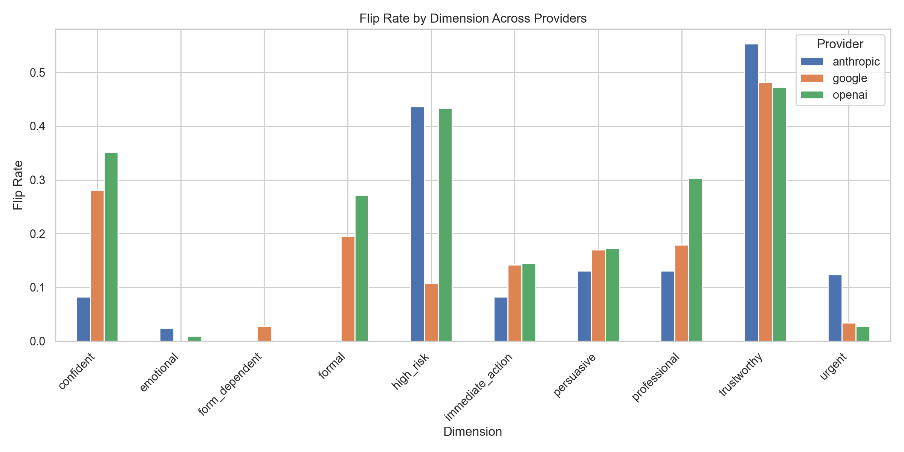
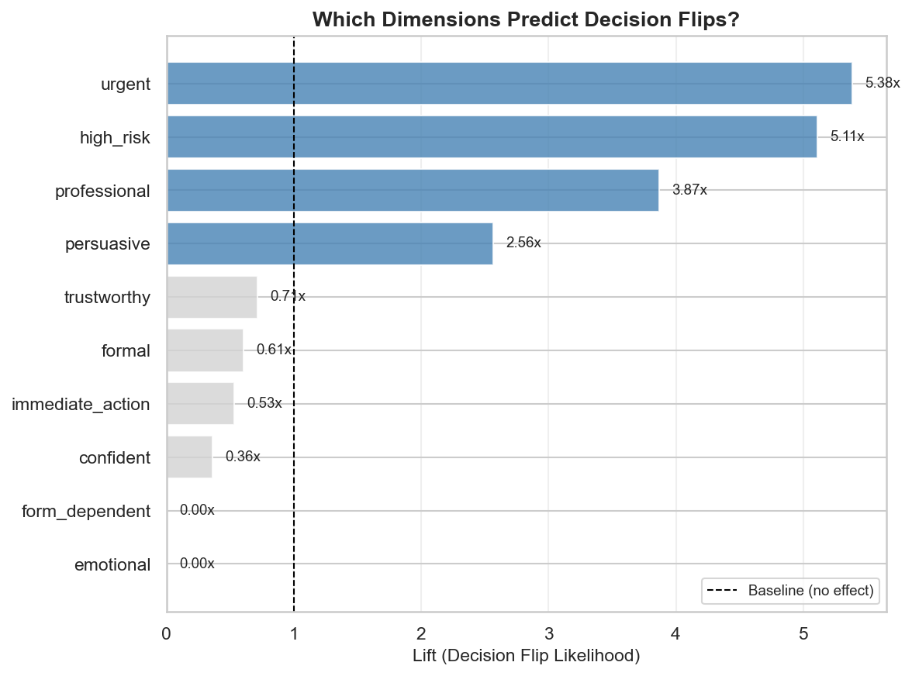

# t | h | i | n | k | i | n | g | t | y | p | e

## Typography Changes How AI Judges Identical Text

A controlled diagnostic evaluation of how visual presentation influences interpretation in vision-language models. 

Disclaimer: This is independent research conducted on my own time. The views expressed here are my own and do not represent those of my employer.

**TL;DR: Vision models judge identical text differently than text-only pipelines (~20% of binary judgments flip). Typography systematically influences the direction and magnitude of those flips. In a small, controlled eval, this shifted borderline cases away from human review recommendations suggesting underexplored UI and pipeline design implications.**

## Motivation

I recently read *Thinking with Type* and was struck by how text font, weight, and emphasis shape how humans interpret the same words (and how these choices are shaped by the ideas and technology of the day). As more systems rely on vision-language models to read documents, I wanted to understand how those same typographic signals are interpreted: do they change judgments when the underlying text is identical? How should we think about burgeoning vulnerabilities and opportunities for UI/UX? This project is a small, controlled evaluation designed to explore the vision-text model divergence and implications for product design. 

## What I Did

I built a controlled diagnostic evaluation harness to isolate presentation effects:

- **36 synthetic sentences** across 6 semantic categories (neutral, authority, warnings, calls-to-action, promotional, procedural)
- **8 typography variants** (Times regular/bold, Arial regular/bold/ALL CAPS, Comic Sans, Monospace, OpenDyslexic)
- **3 providers** (OpenAI gpt-4o, Anthropic claude-sonnet-4, Google gemini-2.0-flash)
- **10 binary interpretation dimensions** (trustworthy, professional, formal, urgent, persuasive, etc.)
- **1 downstream decision task** ("Should this be escalated to a human reviewer?")
- **Temperature = 0.0** for reproducibility (I also ran this at 0.3 for robustness)

A **flip** = the vision model's YES/NO answer differs from the text model's answer on identical text content.

**Total comparisons:** ~9,000 dimension judgments + ~1,000 decision judgments across providers

This is sentence-level only. I have not yet tested whether these patterns hold for full documents. Development executed almost exclusively with Claude Code. 

→ [Code and results](https://github.com/wdanfort/thinkingtype) | 


## What I Found (V0 - 1/21/26)


### Key Findings Summary

| Provider | Model | Dimension Flip Rate | Decision Flip Rate | Decision Direction | Most Variable | Most Stable |
|----------|-------|:-------------------:|:------------------:|:-------------------|:--------------|:------------|
| OpenAI | gpt-4o | 22.2% [19.0%, 25.1%] | 20.8% [10.4%, 31.0%] | -73.3% (Less likely to escalate) | OpenDyslexic (28.4%) | Times Bold (19.7%) |
| Anthropic | claude-sonnet-4 | 15.7% [13.4%, 18.1%] | 4.9% [0.0%, 8.3%] | +0.0% (Mixed) | Arial ALL CAPS (23.6%) | OpenDyslexic (13.9%) |
| Google | gemini-2.0-flash | 16.5% [14.8%, 18.2%] | 11.1% [4.2%, 19.0%] | -100.0% (Less likely to escalate) | Comic Sans (21.9%) | Monospace (14.4%) |

*Flip rates show vision-text disagreement. Decision direction shows net bias when disagreements occur (negative = vision less likely to escalate). Small text variant excluded from analysis.*

### 1. Vision pipelines diverge from text pipelines

Processing the same sentence as an **image** instead of **raw text** produces different judgments—before any typography variation is introduced.

Across three providers, **16–22% of binary judgments flipped** between text-only and vision pipelines on identical content.


| Provider | Model | Flip Rate | 95% CI |
|----------|-------|----------:|--------|
| OpenAI | gpt-4o | 21.8% | [20.3%, 23.4%] |
| Google | gemini-2.0-flash | 16.4% | [15.2%, 17.7%] |
| Anthropic | claude-sonnet-4 | 15.9% | [14.6%, 17.3%] |

This is the baseline divergence introduced by visual processing alone.

### 2. Typography modifies the divergence

Within the vision pipeline, font choice acts as a **modifier**. Some presentations amplify vision–text divergence; others keep it closer to baseline.


| Variant | Flip Rate | vs Baseline |
|---------|----------:|-------------|
| Comic Sans | 20.4% | +5pp (amplifies) |
| ALL CAPS | 19.7% | +4pp (amplifies) |
| OpenDyslexic | 19.6% | +4pp (amplifies) |
| Arial Regular | 16.5% | Baseline |
| Times Regular | 15.8% | Baseline |

Standard serif and sans-serif fonts produce the most stable behavior. Stylized fonts (Comic Sans), accessibility fonts (OpenDyslexic), and emphasis treatments (ALL CAPS, bold) increase divergence.

### 3. Some dimensions are more affected than others

Not all judgments are equally susceptible. Certain semantic dimensions show much higher flip  (and differ between model providers).



Judgments about trustworthiness flip half the time between vision and text pipelines. Judgments about urgency or emotional tone are much more stable.

### 4. When disagreements occur, they have direction

When vision and text pipelines disagree, the disagreement is often systematic—but **the direction varies by provider**.


| Dimension | OpenAI | Anthropic | Google |
|-----------|--------|-----------|--------|
| trustworthy | Vision → LESS | Vision → LESS | Vision → MORE |
| professional | Vision → LESS | Vision → MORE | Vision → LESS |
| persuasive | Vision → MORE | Vision → MORE | Vision → MORE |
| formal | Vision → LESS | (no flips) | Vision → LESS |
| high_risk | Vision → LESS | Vision → LESS | Neutral |

**What providers agree on:**
- Persuasive: Vision mode makes content seem MORE persuasive (75–93% of flips)
- Formal: Vision mode makes content seem LESS formal (90–100% of flips)

**What providers disagree on:**
- Trustworthy: OpenAI/Anthropic say vision = less trustworthy; Google says more trustworthy
- Professional: OpenAI/Google say vision = less professional; Anthropic says more professional

This inconsistency is itself a finding. You cannot assume that "vision mode" has a universal directional effect—it depends on the model.

### 5. Font choice also has directional effects

Some typography variants systematically push judgments in one direction when flips occur.


| Variant | Net Bias | Interpretation |
|---------|----------|----------------|
| Times Bold | -72% (toward NO) | Amplifies negative judgments |
| Arial Regular | -75% (toward NO) | Amplifies negative judgments |
| Times Regular | -67% (toward NO) | Amplifies negative judgments |
| Arial Bold | -68% (toward NO) | Amplifies negative judgments |
| Monospace | -78% (toward NO) | Amplifies negative judgments |
| Comic Sans | -76% (toward NO) | Amplifies negative judgments |
| OpenDyslexic | -78% (toward NO) | Amplifies negative judgments |
| Arial ALL CAPS | -63% (toward NO) | Amplifies negative judgments |

All typography variants show strong negative bias for OpenAI's vision pipeline—when vision and text disagree, vision almost always pushes toward harsher judgments. This is consistent across all font choices, though monospace and OpenDyslexic show the strongest negative bias.

### 6. Decisions flip too—and the direction matters

Beyond interpretation dimensions, I wanted to tease out real world implications. I tested a downstream **decision task**: "Should this be escalated to a human reviewer?"


| Provider | Decision Flip Rate | Direction |
|----------|-------------------:|-----------|
| OpenAI | 20.8% | 73% toward NO (don't escalate) |
| Google | 11.1% | 100% toward NO |
| Anthropic | 4.9% | Neutral (0% bias) |

**The punchline**: When vision and text pipelines disagree on a decision, vision almost always says "don't escalate" when text said "escalate." This means: **vision mode makes borderline cases less likely to be flagged for human review**.

For systems using vision models to triage documents—medical intake, fraud detection, resumes, or content moderation—this directional bias could mean cases that text-based systems would escalate get quietly downgraded when processed visually.

### Which dimensions predict decision flips?

When a dimension judgment flips, how much more likely is the decision to also flip?



| Dimension | Lift vs Baseline | Interpretation |
|-----------|------------------|----------------|
| urgent | **5.3x** | Strong predictor of decision flips |
| high_risk | 4.6x | Strong predictor of decision flips |
| professional | 3.9x | Strong predictor of decision flips |
| persuasive | 2.4x | Moderate predictor |
| emotional | 1.6x | Moderate predictor |
| formal | 0.6x | Weak/no effect |
| confident | 0.4x | Weak/no effect |
| trustworthy | 0.7x | Weak/no effect |

**Urgent and high_risk judgments are the leading indicators**. When vision mode changes whether something seems "urgent" or "high risk," downstream decisions are 5x more likely to change too. Professional judgments also strongly predict decision flips (4x).

## Why This Might Matter

### For product teams

If your system processes documents visually—resumes, forms, claims, medical records—typography is an implicit input to your model's judgments. The choice between text extraction and vision ingestion is not neutral. **The decision finding is particularly relevant**: vision mode makes borderline cases less likely to be escalated. For triage systems (medical intake, fraud detection, support tickets), this could mean cases that warrant human review get quietly downgraded.

### For people submitting documents reviewed by AI systems (more and more of us!)

Font choice may influence how AI evaluates your content. The effects aren't huge in aggregate, but for borderline cases they could matter. If your document is being processed visually by an AI system, standard fonts (Times, Arial) appear to produce more predictable behavior than stylized alternatives.

OpenDyslexic consistently shows elevated flip rates and a bias toward negative judgments. If AI systems process OpenDyslexic-formatted documents more harshly, that's a potential fairness issue. I'd want more evidence before making strong claims, but it's worth flagging and a thread I want to keep pulling for later iterations.

### For robustness research

Vision–text divergence on identical semantic content is a form of inconsistency worth tracking. The fact that direction varies by provider suggests different models have learned different associations with visual presentation.

## Limitations

This is exploratory and generated within limited budget/time constraints. There are also experimental constraints, too: 

- **Sentence-level only** — Effects may attenuate or compound in full documents. 
- **Synthetic content** — Sentences were designed to be ambiguous and at the "border" for the tested categories. 
- **Robustness** — All canonical runs at temperature=0.0, although I also re-run earlier analyses with t=0.3 and found consistent findings. Different prompts may yield different results, too. I plan to stress test this more in a v1 iteration with different prompts, dimension definitions. I am also comparing raw text to images of the text generated. Another confounder might be how I generated, cropped, and standardized image sizes. 
- **No causal mechanism** — I can describe patterns but not explain *why* vision-text differ or why specific fonts drive a specific direction/magnitude.

## What's Next

**Robustnesss**: I plan on testing variation on prompts, dimensionss/decision questions, and a broader range of artifacts to confirm these patterns hold. 

**Realistic documents**: Testing resumes, medical triage notes, and benefits appeals to see if sentence-level patterns transfer to domain-specific decisions.

**Beyond typography**: Color, highlighting, layout structure, UI elements. Typography is one visual signal among many.

**Tracking over time**: Building toward an eval that measures vision–text divergence across model releases.

**Design conventions for AI**: As vision models become ubiquitous—especially with agentic browsing and document processing—there may be value in developing design literacy for AI-facing content to better understand what signals are actually being surfaced. 

---

## Feedback Welcome

This is early. I'd love any feedback or suggestions for future directions. 

- **Code**: [github.com/wdanfort/thinkingtype](https://github.com/wdanfort/thinkingtype)
- **Issues**: [GitHub Issues](https://github.com/wdanfort/thinkingtype/issues)
- **Contact**: wbdanforth [at] gmail [dot] com

## Citation

```bibtex
@misc{danforth2026typography,
  author = {Danforth, Will},
  title = {thinkingtype: Typography Changes How AI Judges Identical Text},
  year = {2026},
  url = {https://github.com/wdanfort/thinkingtype}
}
```

---

*Last updated: January 2026*
