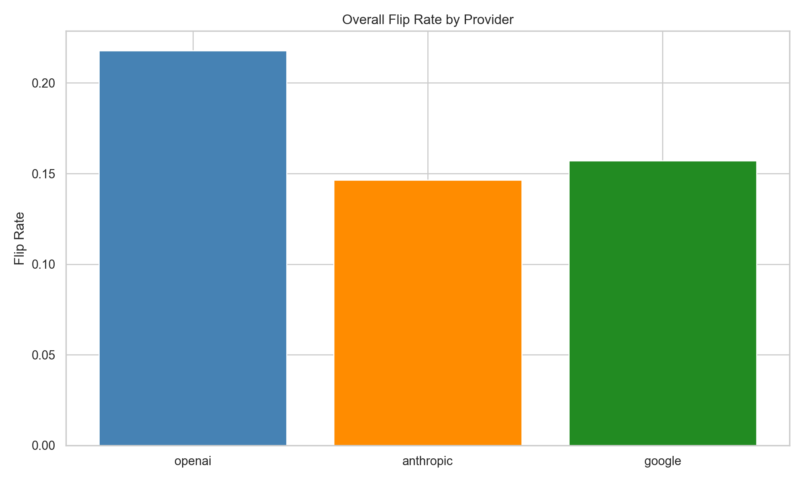
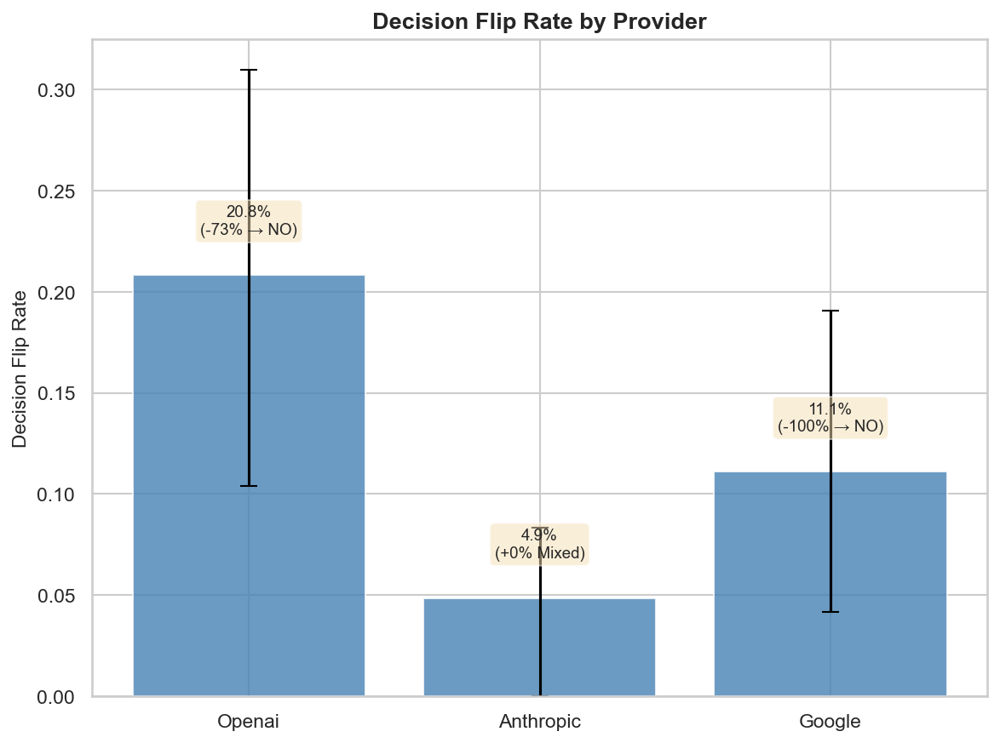
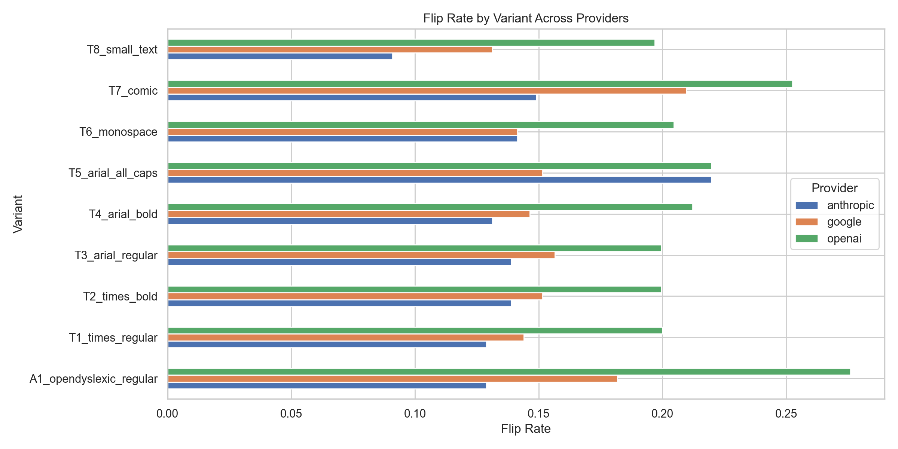
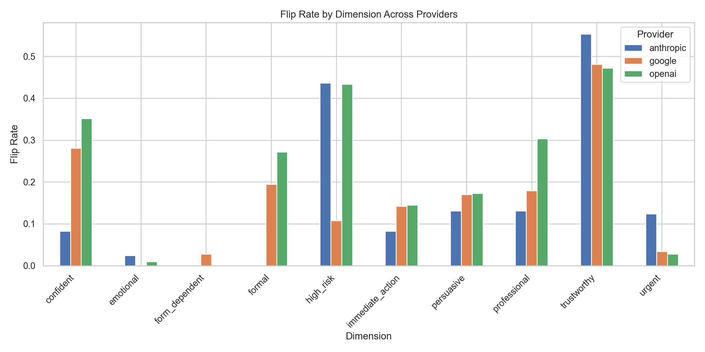
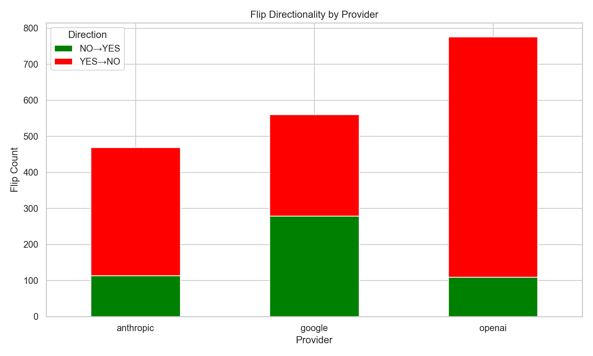
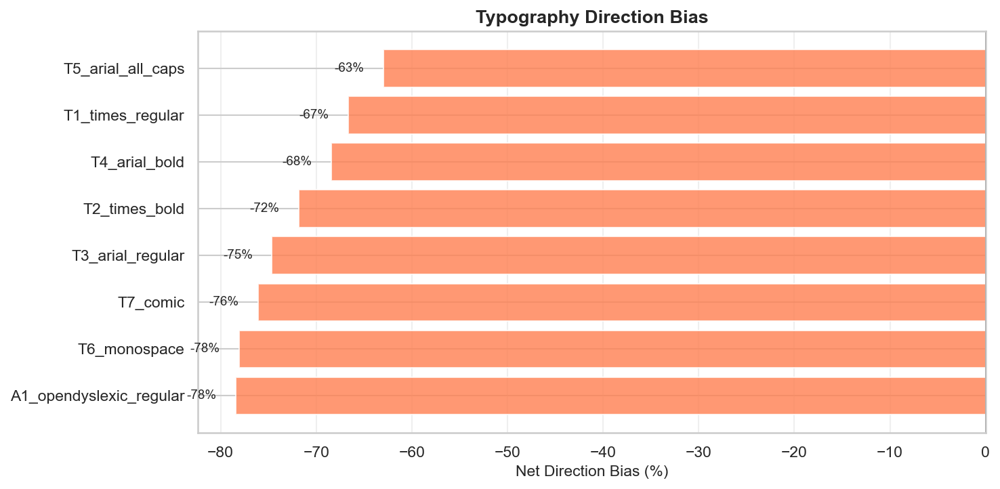
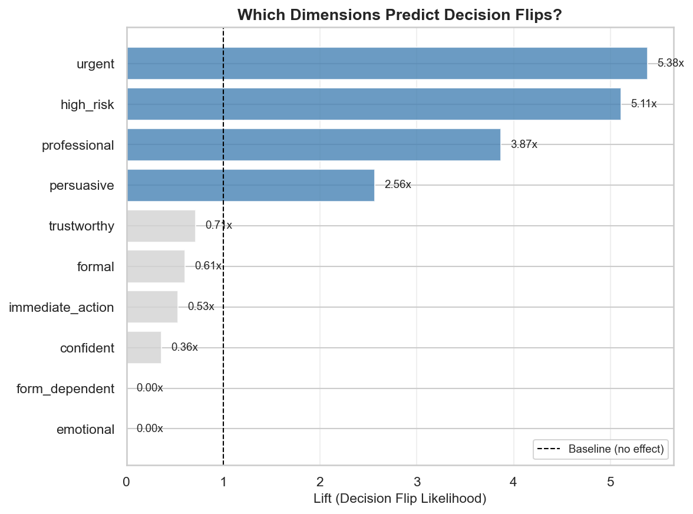

# t | h | i | n | k | i | n | g | t | y | p | e

## Vision-language models "read" text differently than LLMs.

A small, controlled test of how visual presentation changes the way VLMs "read" text.

Disclaimer: This is independent research conducted on my own time. The views expressed here are my own and do not represent those of my employer.

**TL;DR.** VLMs flag fewer borderline cases for human review than text LLMs alone. Font choice seems to matter, too.

## Motivation

I recently read *Thinking with Type* and was struck by how font, weight, and emphasis shape the way humans interpret the same words (and how those choices are themselves shaped by the ideas and tools of the day). More and more systems have VLMs "read" documents directly, so I wanted to know: do those same typographic cues change the model's judgments when the underlying text is identical? What does that mean for product design, and for risk?

## What I Did

I built a small evaluation harness to isolate the effect of presentation:

- **36 synthetic sentences** across 6 semantic categories (neutral, authority, warnings, calls-to-action, promotional, procedural)
- **8 typography variants** (Times regular/bold, Arial regular/bold/ALL CAPS, Comic Sans, Monospace, OpenDyslexic)
- **3 providers** (OpenAI gpt-4o, Anthropic claude-sonnet-4, Google gemini-2.0-flash)
- **10 yes/no judgment dimensions** (trustworthy, professional, formal, urgent, persuasive, and so on)
- **1 downstream decision question** ("Should this be sent to a human reviewer?")
- **Temperature 0.0** for reproducibility, with a re-run at 0.3 as a check

A **flip** is when the VLM's yes/no answer differs from the LLM's answer on the same content.

**Total comparisons:** about 9,000 dimension judgments and about 1,000 decision judgments across providers.

This is sentence-level only. I have not tested whether these patterns hold for full documents. Built almost entirely with Claude Code.

→ [Code and results](https://github.com/wdanfort/thinkingtype) |


## What I Found (V0, 1/21/26)

> **Note on model versions.** This run uses gpt-4o, claude-sonnet-4, and gemini-2.0-flash. None are the most recent model from their provider. A re-run on current frontier models is planned (see What's Next).

### Key Findings Summary

| Provider | Model | Dimension Flip Rate | Decision Flip Rate | Decision Direction | Most Variable | Most Stable |
|----------|-------|:-------------------:|:------------------:|:-------------------|:--------------|:------------|
| OpenAI | gpt-4o | 22.2% [19.0%, 25.1%] | 20.8% [10.4%, 31.0%] | -73.3% (less likely to send to a human) | OpenDyslexic (28.4%) | Times Bold (19.7%) |
| Anthropic | claude-sonnet-4 | 15.7% [13.4%, 18.1%] | 4.9% [0.0%, 8.3%] | +0.0% (roughly even) | Arial ALL CAPS (23.6%) | OpenDyslexic (13.9%) |
| Google | gemini-2.0-flash | 16.5% [14.8%, 18.2%] | 11.1% [4.2%, 19.0%] | -100.0% (less likely to send to a human) | Comic Sans (21.9%) | Monospace (14.4%) |

*Flip rates show how often the LLM and VLM disagree on the same content. Decision direction shows the net lean when they disagree (negative means the VLM is less likely to send the case to a human). The small-text variant is left out of the analysis.*

> **The main finding**
>
> Borderline cases are less likely to reach a human reviewer when a VLM "reads" them as images. The size of the effect depends on the provider.
>
> When an LLM and VLM disagree on whether to send a case to a human, the disagreement almost always lands on the "don't send" side: 73 percent for OpenAI, 100 percent for Google, and roughly even for Anthropic. For automated triage in medical intake, fraud detection, resumes, or content moderation, that means cases a text-only LLM pipeline would flag may get quietly dropped by an otherwise-similar VLM pipeline. Detail in Finding 2 below; sample size is small, see Limitations.

### 1. LLMs and VLMs disagree on the same content

The same sentence given to a model as an **image** instead of **plain text** produces different judgments, before font choice enters the picture at all. This is the baseline gap from how the VLM "reads" an image versus how the LLM reads plain text, not a font effect.

Across three providers, **16 to 22 percent of yes/no judgments flip** between the LLM and the VLM on the same content. That is the average across 10 dimensions; some dimensions move much more than others (see Finding 4).



| Provider | Model | Flip Rate | 95% CI |
|----------|-------|----------:|--------|
| OpenAI | gpt-4o | 21.8% | [20.3%, 23.4%] |
| Google | gemini-2.0-flash | 16.4% | [15.2%, 17.7%] |
| Anthropic | claude-sonnet-4 | 15.9% | [14.6%, 17.3%] |

### 2. When LLM and VLM disagree on a triage decision, the VLM almost always says "don't send to a human"

Beyond yes/no dimensions, I asked a downstream **decision question**: "Should this be sent to a human reviewer?" This is the finding with the clearest practical implications, and the one this page is built around.



| Provider | Decision Flip Rate | Direction |
|----------|-------------------:|-----------|
| OpenAI | 20.8% | 73% toward NO (don't send) |
| Google | 11.1% | 100% toward NO |
| Anthropic | 4.9% | Roughly even (0% lean) |

When the LLM and VLM disagree on whether to send a case to a human, OpenAI and Google almost always land on the "don't send" side. Anthropic is roughly even. In practice, borderline cases are less likely to reach a human when a VLM "reads" them rather than an LLM. The size of the effect depends on the provider.

For systems that use VLMs to triage documents (medical intake, fraud detection, resumes, content moderation), cases the text-only LLM pipeline would send to a human may quietly get dropped on the VLM side. Sample size on the decision question is small (see Limitations), so take the exact numbers as suggestive rather than precise.

### 3. Font choice changes the size of the gap (up to about 5 points)

Within the VLM, font choice changes how big the gap with the LLM is. Some fonts widen it. Others keep it near the average. The effect is real but small: up to about 5 percentage points on the flip rate, which is much smaller than the LLM/VLM gap itself in Finding 1.



| Variant | Flip Rate | vs Baseline |
|---------|----------:|-------------|
| Comic Sans | 20.4% | +5pp (widens the gap) |
| ALL CAPS | 19.7% | +4pp (widens the gap) |
| OpenDyslexic | 19.6% | +4pp (widens the gap) |
| Arial Regular | 16.5% | Baseline |
| Times Regular | 15.8% | Baseline |

Standard serif and sans-serif fonts produce the most stable behavior. Stylized fonts (Comic Sans), accessibility fonts (OpenDyslexic), and emphasis treatments (ALL CAPS, bold) widen the gap.

### 4. Some dimensions move much more than others

Not all judgments shift equally. A few dimensions flip much more often than the rest, and which dimensions move most differs by provider.



Judgments about **trustworthiness flip about half the time** between an LLM and a VLM "reading" the same content. This is the most volatile of the 10 dimensions, and the source of the "about 50 percent" figure people sometimes quote. Judgments about urgency and emotional tone are much more stable. The 16 to 22 percent headline number is the average across all 10 dimensions, so the picture is more spread out per dimension than the average suggests.

### 5. When the LLM and VLM disagree, the disagreement has a direction

When the LLM and VLM disagree, the disagreement is often systematic, but **the direction depends on the provider**.



| Dimension | OpenAI | Anthropic | Google |
|-----------|--------|-----------|--------|
| trustworthy | VLM → LESS | VLM → LESS | VLM → MORE |
| professional | VLM → LESS | VLM → MORE | VLM → LESS |
| persuasive | VLM → MORE | VLM → MORE | VLM → MORE |
| formal | VLM → LESS | (no flips) | VLM → LESS |
| high_risk | VLM → LESS | VLM → LESS | Neutral |

**What providers agree on:**
- Persuasive: a VLM "reads" the same content as MORE persuasive than an LLM does (75 to 93 percent of flips)
- Formal: a VLM "reads" the same content as LESS formal than an LLM does (90 to 100 percent of flips)

**What providers disagree on:**
- Trustworthy: OpenAI and Anthropic VLMs "read" content as less trustworthy than their LLMs do. Google's VLM "reads" it as more trustworthy.
- Professional: OpenAI and Google VLMs "read" content as less professional. Anthropic's VLM "reads" it as more professional.

That inconsistency is itself a finding. There is no single direction VLMs push in. It depends on the model.

### 6. Font choice also has a direction

Some font variants push judgments in one direction when flips happen.



| Variant | Net Lean | Interpretation |
|---------|----------|----------------|
| Times Bold | -72% (toward NO) | Pushes toward harsher judgments |
| Arial Regular | -75% (toward NO) | Pushes toward harsher judgments |
| Times Regular | -67% (toward NO) | Pushes toward harsher judgments |
| Arial Bold | -68% (toward NO) | Pushes toward harsher judgments |
| Monospace | -78% (toward NO) | Pushes toward harsher judgments |
| Comic Sans | -76% (toward NO) | Pushes toward harsher judgments |
| OpenDyslexic | -78% (toward NO) | Pushes toward harsher judgments |
| Arial ALL CAPS | -63% (toward NO) | Pushes toward harsher judgments |

Every font variant shows a strong negative lean for OpenAI's VLM. When the LLM and VLM disagree, the VLM almost always pushes toward harsher judgments. This is true across all font choices, though monospace and OpenDyslexic show the strongest negative lean.

### 7. Some dimension flips strongly predict decision flips

When a dimension judgment flips, how much more likely is the "send to a human?" decision to also flip? This connects Findings 4 through 6 back to Finding 2.



| Dimension | Lift vs Baseline | Interpretation |
|-----------|------------------|----------------|
| urgent | **5.3x** | Strong predictor of decision flips |
| high_risk | 4.6x | Strong predictor of decision flips |
| professional | 3.9x | Strong predictor of decision flips |
| persuasive | 2.4x | Moderate predictor |
| emotional | 1.6x | Moderate predictor |
| formal | 0.6x | Weak or no effect |
| confident | 0.4x | Weak or no effect |
| trustworthy | 0.7x | Weak or no effect |

**Urgent and high_risk are the leading indicators.** When a VLM "reads" the content and changes whether something looks "urgent" or "high risk," the downstream decision is about 5 times more likely to change too. Professional judgments also strongly predict decision flips (about 4 times). One thing worth flagging: trustworthiness, the most volatile dimension, is *not* a strong predictor of decision flips. That is part of why the headline "about 50 percent" trustworthiness figure can mislead about the practical stakes.

## Why This Might Matter

### For product teams

If your system has VLMs "read" documents directly (resumes, forms, claims, medical records), typography is an unspoken input to the model's judgments. **The decision finding is the one to watch**: when a VLM "reads" a case, it is less likely to be sent to a human than when an LLM "reads" the same content as text. For triage systems (medical intake, fraud detection, support tickets), that means cases that warrant a human look may get quietly dropped.

### For people submitting documents that VLMs "read" (more and more of us)

Font choice can change how a VLM scores your content. The average effect is small, but it can matter for borderline cases. If your document is going to a VLM as an image, standard fonts like Times and Arial seem to produce more predictable behavior than stylized fonts.

OpenDyslexic shows higher flip rates and a lean toward harsher judgments. If VLMs score OpenDyslexic-formatted documents more harshly, that is a possible fairness issue. I want more evidence before making strong claims, but it is worth flagging, and a thread I want to keep pulling on.

### For robustness research

The LLM/VLM gap on the same content is a form of inconsistency worth tracking. The fact that the direction varies by provider suggests different models have learned different associations with how text looks on the page.

## Related Work

**Visual text style and VLM judgments.** The closest published precedent is Wang, Larson, and Zhao ([2026](https://arxiv.org/abs/2604.27553)), who render a concept word as visual text in two style families (functional, readability-oriented; and decorative, display-oriented) and show that the VLM's attribute-based description of that concept shifts with the visual style, even when the concept itself is correctly identified. They frame this as style leakage from the visual surface into semantic inference. Their finding and ours converge on the same broader claim: visual text style affects VLM judgments. The setup here differs in three ways. (1) It compares VLM judgments against an LLM baseline on the same content, head-to-head per provider, so the "16 to 22 percent" gap is between modalities rather than between styles. (2) It scores 10 fixed binary yes/no dimensions instead of open-ended attribute descriptions. (3) It adds a downstream "send this case to a human reviewer?" decision question and reports the directional asymmetry there. Wang et al. is prior published work on the typography-affects-VLM-judgments finding; the contribution of this page is the LLM/VLM head-to-head framing, the controlled binary dimensions, and the decision-asymmetry result.

**Prompt-format sensitivity in LLMs.** Sclar, Choi, Tsvetkov, and Suhr ([2024](https://arxiv.org/abs/2310.11324)) showed that LLM accuracy on a fixed task can swing by as much as 76 points across plausible-but-equivalent prompt formats (whitespace, separators, casing, item delimiters). The instability persists with larger models, more few-shot examples, and instruction tuning. This project asks the analogous question for VLMs: when the surface is visual rather than textual, how much do judgments move?

**VLM hallucination and benchmarking.** Li et al. ([POPE, EMNLP 2023](https://arxiv.org/abs/2305.10355)) probe object-existence hallucination via polling-style queries. Guan et al. ([HallusionBench, CVPR 2024](https://arxiv.org/abs/2310.14566)) test entangled language hallucination and visual illusion. These benchmarks largely ask whether the VLM gets the *contents* right. This project assumes the contents are recognized correctly and asks whether the model's judgment about those contents stays stable as the visual presentation of the same text changes.

**Typographic attacks on multimodal models.** Goh et al. ([Distill 2021](https://distill.pub/2021/multimodal-neurons/)) documented that CLIP's "multimodal neurons" respond to written words inside images, and that handwritten text on an object can override its classification. Qi et al. ([AAAI 2024](https://arxiv.org/abs/2306.13213)) showed visual adversarial inputs can jailbreak aligned multimodal models. Both lines of work involve adversarial or attack-style typography. The fonts in this project are standard, everyday fonts, and the question is downstream judgment drift rather than whether the model can extract the text correctly.

## Limitations

This is exploratory and was built within a small time and budget. A few specific caveats:

- **Models are not the latest from each provider.** Runs use gpt-4o, claude-sonnet-4, and gemini-2.0-flash. Newer frontier models from each provider are out, and a re-run on those is planned.
- **Sentence-level only.** Effects may shrink or compound in full documents.
- **Synthetic content.** Sentences were written to be ambiguous and to sit at the border of the categories I tested.
- **Robustness.** All main runs were at temperature 0.0. I re-ran earlier analyses at temperature 0.3 and got consistent findings. Different prompts could give different results. I plan to stress test this more in a v1 iteration with different prompts and dimension definitions. I am also comparing raw text to images of that text. How I generated, cropped, and sized those images may be a confounder.
- **No causal mechanism.** I can describe the patterns but not explain *why* the LLM and VLM differ, or why specific fonts push in a specific direction.

## What's Next

**Newer models.** Re-running this against the latest models from each provider (the runs above are not on current frontier models) to see how the baseline is moving.

**Robustness.** Vary the prompts, the dimension and decision questions, and the range of artifacts to see if the patterns hold up.

**Realistic documents.** Test resumes, medical triage notes, and benefits appeals to see if sentence-level patterns carry over to domain-specific decisions.

**Beyond fonts.** Color, highlighting, layout, UI elements. Typography is one visual cue among many.

**Tracking over time.** Build toward an eval that watches the LLM/VLM gap as models update.

**Design rules for VLM-facing content.** VLMs are now part of agent browsing and document processing pipelines. There may be value in developing design literacy for content a VLM is going to "read," so we know what signals are actually getting picked up.

---

## Feedback Welcome

This is early. I'd love any feedback or suggestions for future directions.

- **Code**: [github.com/wdanfort/thinkingtype](https://github.com/wdanfort/thinkingtype)
- **Issues**: [GitHub Issues](https://github.com/wdanfort/thinkingtype/issues)
- **Contact**: wbdanforth [at] gmail [dot] com

## Citation

```bibtex
@misc{danforth2026typography,
  author = {Danforth, Will},
  title = {thinkingtype: Vision-language models "read" text differently than LLMs},
  year = {2026},
  url = {https://github.com/wdanfort/thinkingtype}
}
```

---

*Last updated: January 2026*
