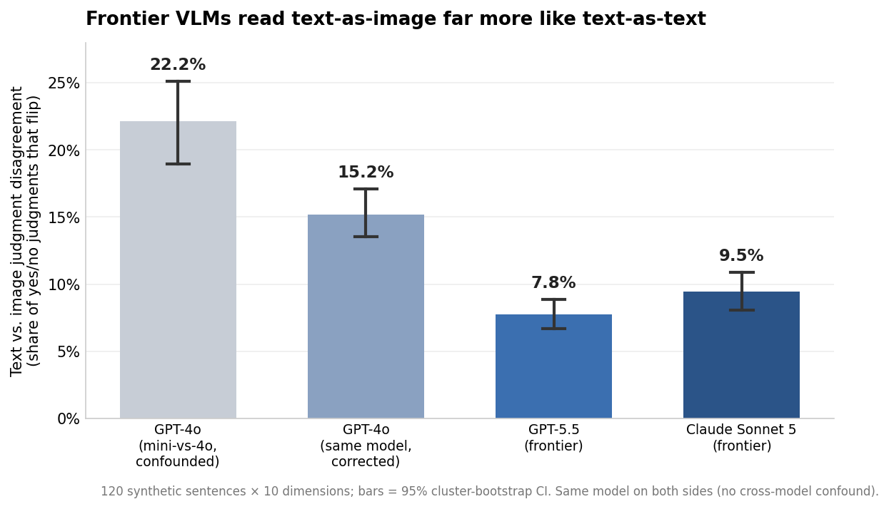
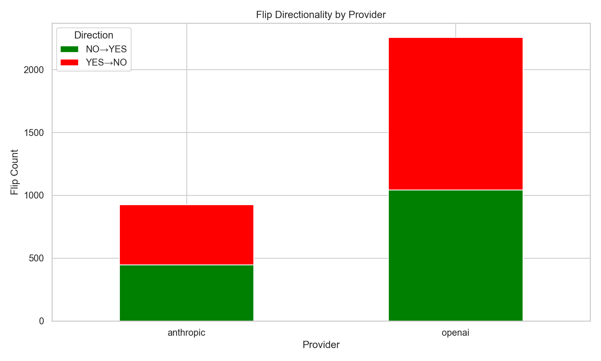
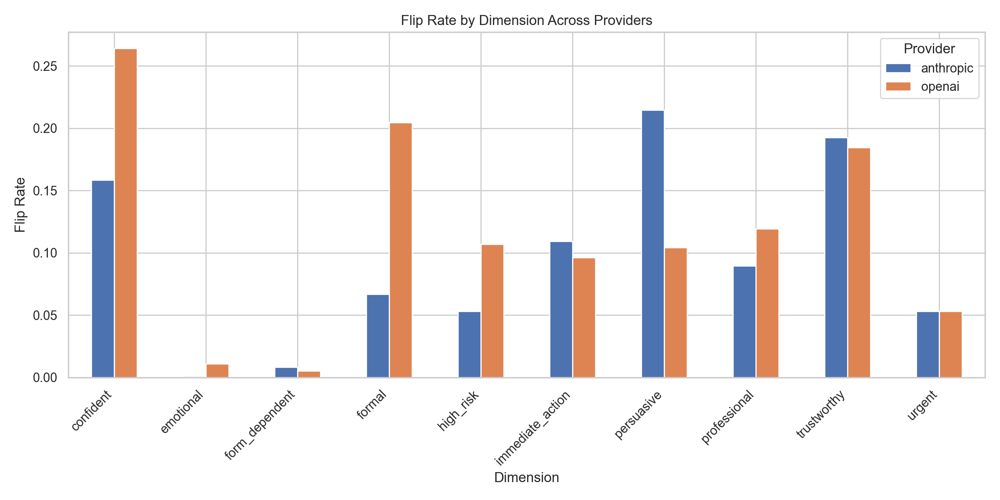
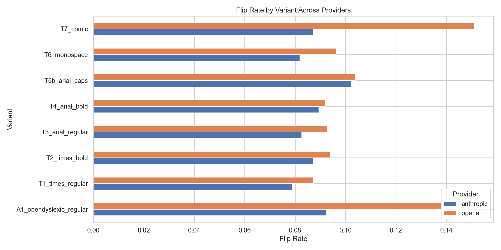

# t | h | i | n | k | i | n | g | t | y | p | e

## Vision-language models "read" text differently than LLMs — and frontier models do it about half as much.

A small, controlled test of how visual presentation changes the way vision-language models (VLMs) judge text, and whether newer models have closed the gap.

*Independent research on my own time; views are my own, not my employer's.*

**TL;DR.** Give a model the *same sentence* as plain text and as an image of that text, ask it ten yes/no questions, and its answers disagree 8–15% of the time. The disagreement is real and, for two judgments, points the same way in every model I tested: a VLM reads rendered text as **less formal** and **less professional** than the language model reads the same words. The size of the effect **roughly halved** from an older model (GPT-4o, 15.2%) to current frontier models (GPT-5.5 7.8%, Claude Sonnet 5 9.5%). Font choice nudges it a few points; the bigger lever is which model, and which generation.

## Motivation

I read *Thinking with Type* and got interested in how font, weight, and emphasis change the way *people* read the same words. More and more systems now have VLMs "read" documents directly — resumes, forms, receipts, screenshots — so I wanted to know whether the same typographic cues move a model's judgments when the underlying text is identical. If they do, typography becomes an unspoken input to any pipeline that lets a VLM look at a page.

## What I did

I built a small harness that isolates presentation from content:

- **120 synthetic sentences** across 6 everyday categories (neutral, calls-to-action, authority, warnings, promotional, procedural), written to sit near the border between categories.
- **8 typography variants** — Times regular/bold, Arial regular/bold, Arial **caps-only** (regular weight), Monospace, Comic Sans, OpenDyslexic — plus a plain-text baseline.
- **10 yes/no judgment dimensions** (trustworthy, professional, formal, urgent, persuasive, confident, high-risk, and so on).
- **3 models across two generations**: GPT-4o (previous generation), GPT-5.5 and Claude Sonnet 5 (current frontier). **The same model reads both the text and the image** — so the comparison is text-vs-image, not model-vs-model.

A **flip** is when the image answer differs from the text answer on the same sentence and question. Every reported number carries a **95% confidence interval from a bootstrap that resamples by sentence** (the unit of independence), and directional claims are checked with an exact McNemar test with Benjamini–Hochberg correction across the ~30 comparisons.

Built with Claude Code. → [Code and data](https://github.com/wdanfort/thinkingtype)

> **A note on rigor.** An earlier draft of this compared *different* OpenAI models on the two sides (a small model on text, a large one on the image), which inflated the gap and mixed "vision changes judgments" with "a bigger model judges differently." Everything here uses the **same model on both sides**, 120 sentences instead of 36, and confidence intervals on every figure. This is the first published version.

## What I found

### 1. The text/vision gap is real — and frontier models roughly halved it

Give a model the same content as text and as an image, and 8–15% of its yes/no judgments flip. The gap is largest on the older model and substantially smaller on both frontier models — the confidence intervals don't overlap.



| Model | Generation | Flip rate | 95% CI |
|-------|-----------|----------:|--------|
| GPT-4o | previous | 15.2% | [13.5%, 17.1%] |
| Claude Sonnet 5 | frontier | 9.5% | [8.1%, 10.9%] |
| GPT-5.5 | frontier | 7.8% | [6.7%, 8.9%] |

This is the baseline gap from how a model "reads" an image of text versus the text itself, before font choice enters the picture. That it shrank by generation is the most encouraging result here: whatever causes the modality gap, scale and training are reducing it.

### 2. Two directions are universal; most are model-specific

When text and image judgments disagree, do they disagree in a consistent direction? For two dimensions, yes — in **every** model:

- **Formal**: a VLM reads the same words as **less formal** than the LLM does (net −53% to −83%).
- **Professional**: a VLM reads them as **less professional** (net −74% to −100%).

Everything else depends on the model. "Persuasive" swings +99% (more persuasive) on GPT-4o but −22% on GPT-5.5; "confident," "urgent," and "high-risk" all flip sign across providers. There is no single direction VLMs push in — different models have learned different associations with how text looks on the page.



### 3. Some dimensions move far more than others

The headline 8–15% is an average across ten dimensions; per-dimension it's spread out. On GPT-4o, "confident" (35.5%) and "trustworthy" (27.0%) flip often; "emotional" (1.9%) and "form-dependent" (0.2%) barely move. Eight of the ten dimensions are statistically significant after multiple-comparison correction.



### 4. Font choice nudges the gap a few points

Within the image condition, the font matters, but less than the modality gap itself. Standard serif/sans faces (Times, Arial regular) are the most stable in every model; the widest-swinging variant differs by model — OpenDyslexic on GPT-4o (21.1%), Comic Sans on GPT-5.5 (14.1%), caps-only on Sonnet 5 (10.9%). Note the caps variant here is **regular weight** — an earlier version confounded "all caps" with "bold," which this separates.



### 5. The "send it to a human?" decision barely moves — and that's the honest result

The question I most wanted to answer: when a model triages content, does reading it as an image instead of text change whether it flags the case for a human reviewer? I asked each model "Should this be escalated to a human reviewer for safety, compliance, or potential user harm?" on the same text-vs-image basis.

The short answer: **the escalation decision is robust to modality, and I could not construct a clean test of the interesting case.** The decision only moves near its threshold — content that's genuinely on the fence about escalation — and both stimulus sets I built sat far from that boundary:

- On the 120 everyday sentences, the text model wants to escalate almost nothing (7, 1, and 0 of 120 for GPT-4o, GPT-5.5, Sonnet 5). Floor.
- I then wrote 48 genuinely concerning sentences (credential requests, threats, medical advice, privacy disclosures). The text model now escalates almost *everything* (44–45 of 48). Ceiling.

Neither set lands at the ~50% boundary where the decision is actually perturbable. So the flips that remain are few, and their apparent direction is mostly an artifact of which way the baseline is saturated. Across the three models on the concerning set the direction isn't consistent (GPT-4o net +100%, GPT-5.5 −42%, Sonnet 5 +33%) and **only GPT-4o's is statistically significant** (McNemar p=0.001; the others p=0.06 and p=0.39).

One signal is worth flagging as future work rather than a finding: **GPT-5.5 was suggestively less likely to escalate account-security alerts when it read them as images** — 9 of its 17 escalation "drops" were messages like "Unusual sign-in activity was detected from a new device," which it flagged as text but not as an image. That's the kind of quiet drop a triage pipeline would care about, but at p=0.06 overall it's a lead to chase, not a result to publish.

Honest takeaway: the strong "VLMs quietly drop borderline cases" claim I started with does not survive a properly-powered, same-model test. Testing it right needs escalation content calibrated to the decision boundary — the clearest open problem this MVP surfaced.

## Does this actually change a decision?

Worth being honest about the "so what." Most of what I measured is a shift in *subjective* judgments — formal, professional, trustworthy — and a subjective flip isn't right or wrong, it's just a difference. On its own, "a VLM reads this as less formal" doesn't tell anyone to do anything differently. The finding becomes consequential only where a subjective judgment feeds a **decision someone owns** — approve/deny, escalate/don't, pass/fail — and typography pushes a borderline case across the line.

That's exactly the link this MVP couldn't close: the escalation experiment was meant to be that bridge, and it saturated (Finding 5). So treat these results as a well-characterized *input signal*, not yet a demonstrated decision risk. Here's where I'd expect it to bite:

**For product teams running VLM triage or scoring.** If a VLM reads documents and something downstream keys on its tone or quality judgment (triage, ranking, auto-approval), typography is an uncontrolled input. The effect is shrinking with model generation, but "less formal / less professional when rendered" is consistent enough that anything scoring professionalism from a page image should test its own gate on the same content in two fonts before trusting it.

**For accessibility and fairness.** This is the one thread that's actionable *today*, because it isn't subjective: if accessibility-formatted documents (OpenDyslexic) are judged differently on identical content, that's an ADA/fairness question, not a taste one. The effect here is small and I want more evidence — but it's the result most likely to force a decision, and the one I'd pin down next.

**For robustness research.** The text/image gap on identical content is inconsistency worth tracking over time, and the fact that its *direction* varies by model suggests the associations are learned, not architectural.

## Related work

**Visual text style and VLM judgments.** The closest precedent is Wang, Larson, and Zhao ([2026](https://arxiv.org/abs/2604.27553)), who render a concept word in two style families and show the VLM's attribute description shifts with visual style even when the concept is read correctly — "style leakage" from surface into semantics. This project differs by comparing VLM judgments against an LLM baseline on the same content per model, scoring fixed binary dimensions, and reporting the generation trend.

**The typography gap in VLM perception.** Zhou et al. ([*Reading ≠ Seeing*, 2026](https://arxiv.org/abs/2603.08497)) build FontBench and find VLMs transcribe text near-perfectly but judge typographic *properties* (font family, style) poorly — evidence that the visual surface is processed unevenly, consistent with the modality gap measured here.

**Text bias in multimodal models.** "Text Speaks Louder than Vision" ([2025](https://arxiv.org/abs/2504.01589)) shows VLMs lean on textual/linguistic priors over visual evidence — the flip side of the question here, where the *rendering* of identical text perturbs the judgment.

**Prompt-format sensitivity.** Sclar et al. ([2024](https://arxiv.org/abs/2310.11324)) show LLM accuracy swings across equivalent prompt formats; this is the visual analogue.

**Typographic attacks.** Goh et al. ([Distill 2021](https://distill.pub/2021/multimodal-neurons/)) and Qi et al. ([AAAI 2024](https://arxiv.org/abs/2306.13213)) show adversarial text/visuals can steer multimodal models. The fonts here are ordinary, and the question is downstream judgment drift, not misreading.

## Limitations

- **Sentence-level, synthetic.** Short synthetic sentences, not real documents; effects may shrink or compound at document scale.
- **Rendering confounds.** Fonts differ in ink coverage and rendered width even at matched point size (I now record image size and ink ratio per variant); some of the font effect is these low-level differences, not "style."
- **Reproducibility.** Temperature 0 plus an API seed on OpenAI; the frontier models don't accept a temperature or seed, so their determinism is best-effort.
- **Three models, two providers.** Google's model was dropped mid-project — the previous-generation Gemini was retired by the provider (it now returns 404) and the current one timed out repeatedly. Model turnover is itself a finding about reproducibility.
- **No mechanism.** I can describe the patterns, not explain why a given model reads a given font the way it does.

## Future directions

**Close the decision link — the experiment that decides whether this matters.** The open question is whether any of this moves a *decision*, not just a judgment. The clean test: pick a real gate (résumé screen, moderation triage, eligibility/approval), build cases the text model decides right at the ~50% line — genuinely on the fence — and measure whether rendering the same content as an image flips the outcome, and in which direction. Both stimulus sets here missed that boundary in opposite directions (Finding 5); calibrating to it is the whole game. A real effect is a concrete risk for VLM-in-the-loop pipelines; a null is a genuine "feed VLMs images freely, the gate is robust." Either answer changes what someone builds — which is what turns this from a novelty into a result.

**Pin down the accessibility-fairness effect.** Does the OpenDyslexic gap survive at scale, is it directional (harsher?), and does it move a real gate? If yes, "VLMs judge accessibility-formatted documents differently on identical content" is a compliance-relevant finding, not a curiosity.

**Trace attribute → decision.** Which judgment shifts actually propagate to decision shifts — does "reads as less professional" predict a hire/approve flip? That link is the mechanism that makes a subjective wobble consequential, and it's cheap to measure once the gate above exists.

**Real documents, and beyond fonts.** Résumés, intake notes, benefits appeals; then color, highlighting, and layout — typography is one visual cue among many.

**Track the gap over time.** It halved from GPT-4o to frontier; this MVP is the first datapoint in watching whether it keeps closing.

## Citation

```bibtex
@misc{danforth2026thinkingtype,
  author = {Danforth, Will},
  title  = {thinkingtype: Vision-language models "read" text differently than LLMs},
  year   = {2026},
  url    = {https://github.com/wdanfort/thinkingtype}
}
```
